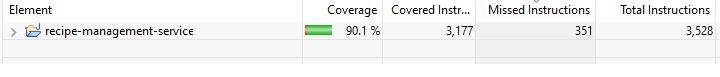
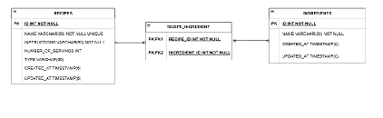

# Recipe Management Service

This repository contains a standalone Java application for managing favorite recipes. Users can add, update, remove, and fetch recipes. Additionally, recipes can be filtered based on vegetarian status, number of servings, specific ingredients (include/exclude), and text search in instructions.

The project demonstrates production-ready Java practices using Spring Boot, REST APIs, database persistence, unit/integration testing, and API documentation.

---

## Features

- **CRUD Operations**: Add, update, delete, and fetch recipes.
- **Filtering**:  
   o Vegetarian or non-vegetarian dishes  
   o Number of servings  
   o Include or exclude specific ingredients  
   o Text search in instructions
- **REST API**: Fully documented using Swagger UI.
- **Database Support**: H2 for development, MySQL for production.
- **Testing**: Unit tests with JUnit & Mockito, integration tests using Spring Boot Test.
- **Logging**: SLF4J logging for monitoring and debugging.
- **Production-Ready**: Uses best practices, design patterns (Factory, Singleton, MVC, DTO), and error handling.

---

## Search Examples

1. Get all vegetarian recipes.
2. Recipes that serve 4 persons and contain "potatoes".
3. Recipes without "salmon" as an ingredient that mention "oven" in instructions.

---

## Architecture Overview

The Recipe Management Service is built using a layered architecture:

- **Controller Layer**: REST API endpoints for managing recipes.
- **Service Layer**: Business logic, filtering, and validation.
- **Repository Layer**: Database access using Spring Data JPA.
- **Entity/DTO Layer**: Represents database entities and data transfer objects.
- **Security Layer**: API key validation and endpoint security using Spring Security.
- **Testing Layer**: Unit and integration tests for ensuring reliability.

### Key Technologies

| Technology | Purpose |
|------------|---------|
|  **Spring Boot** | Simplifies REST API development with auto-configuration. |
|  **Spring Web** | Handles REST endpoints. |
|  **Spring Data JPA / Hibernate** | Provides database persistence and Object-Relational Mapping (ORM).  | 
 /  | Persistent storage: MySQL for production, H2 for dev/test. |
|  **Spring Security** | API key validation and authentication for secure endpoints. |
|  &  **JUnit & Mockito** | Unit testing framework and mocking support. |
|  **Spring Boot Test** | Integration testing with in-memory database support. |
|  **Swagger (springdoc-openapi)** | Auto-generates REST API documentation and interactive UI. |
|  /  **SLF4J / Logback** | Unified logging framework for monitoring and debugging. |

---

## Test Coverage



---
## ER-Diagram




---

## Installation and setup of application

Follow the steps below to run the application:
1. Make sure you have [Java](https://www.oracle.com/java/technologies/javase/jdk17-archive-downloads.html) and [Maven](https://maven.apache.org) installed
2. Clone the [GitHub repository](https://github.com/ramfornarayan/recipe-management-service)
3. Set up your development environment with JDK 17 and Apache Maven.
4. Configure the MariaDB database connection in the `application.properies` file.
5. Build the project using Maven:
   ```shell
   mvn clean install
   ```
5. Run the application using Maven:
   ```shell
   mvn spring-boot:run
   ```
6. Access the API documentation by visiting the Swagger UI endpoint: `http://localhost:8080/swagger-ui/index.html#/`. Use this interface to explore the available API endpoints and test
   them interactively.
